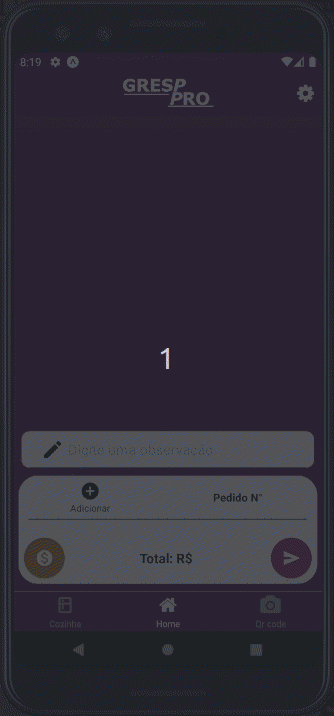
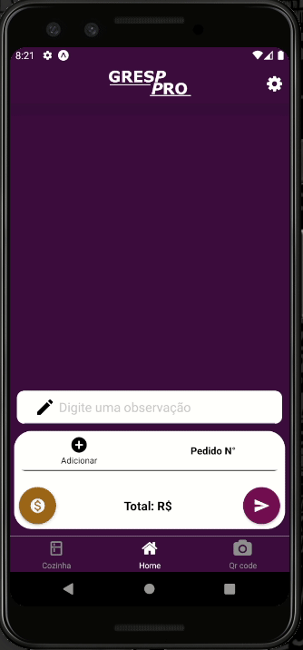

<h1 align="center" >
    
</h1>

<h3 align="center">
  Sistema para agilização do atendimento em restaurantes
</h3>

<p align="center">
  <a href="#dart-projeto">Projeto</a>&nbsp;&nbsp;&nbsp;|&nbsp;&nbsp;&nbsp;
  <a href="#mag-tecnologias">Tecnologias</a>&nbsp;&nbsp;&nbsp;|&nbsp;&nbsp;&nbsp;
    <a href="#information_source-como-usar">Como Usar</a>&nbsp;&nbsp;&nbsp;|&nbsp;&nbsp;&nbsp;
  <a href="#memo-licença">Licença</a>
</p>


<p align="center">
  
  
</p>    

<!-- <p align="flex-start" style="flex-direction:row">
  
  
</p>   -->

## :dart: Projeto
  
<p>   O Gresp pro é um software para tormar mais eficaz e mais rápido o atendimento de um determinado estabelecimentos, sendo esses, atuando no nicho da alimentção. O software permite que o garçon por exemplo, quando for atender um cliente, acesse o aplicativo em um dispositivo movél(celular ou tablet), anotando o pedido do cliente, esse pedido aparecerá em tempo real na cozinha do estabelecimento.</p>

<p>   O sistema independerá de Internet, por tanto, será instalado a partir de um instalador executável, Esse por sua vez, instalará todas as dependências necessárias para o funcionamento do Software. A inicialização será por meio de um executavél. O servidor funcionará na rede local rodado no Node.js e poderá ser acessado pelo app ou pelo proprio computador.</p>

##### Dentre algumas funcinalidades estão: 

* Comunicação em tempo real para criação, atualização e finalização de pedido
* Impressão de comandas para a cozinha
* Realatórios das vendas

## :mag: Tecnologias
-  [Node](https://nodejs.org/en/)
-  [Electron](https://www.electronjs.org/)
-  [Expo](https://expo.io/)
-  [React-Native](https://facebook.github.io/react-native/)

## :information_source: Como Usar
Para testar o projeto, você vai precisar: [Git](https://git-scm.com), [Node.js v10.16](https://nodejs.org/en/) ou maior, [Yarn](https://yarnpkg.com/) ou [Npm](https://www.npmjs.com/), [Expo sdk37 ](https://expo.io/) , [Electron v9.0.0](https://www.electronjs.org/) + [MongoDB v4.2](https://docs.mongodb.com/manual/)  instalados no seu computador. Na linha de comando:

```bash
# Clone o repositório
$ git clone https://github.com/ainertec-developer/gresp-pro.git gresp-pro

# Entre no repositório
$ cd gresp-pro

# Entre na no diretório backend
$ cd backend

# Instale as dependências
$ yarn 
# ou
$ npm i

# Inicie o servidor mongo
$ mongod

# Inicie o backend
$ yarn dev
# ou
$ npm dev

# Entre no diretório mobile
$ cd gresp-pro/mobile

# Instale as dependências
$ yarn 

# Inicie o app
$ yarn start

# Vá para o diretório frontend
$ cd gresp-pro/frontend

# Instale as dependências
$ yarn 

# Inicie o app
$ yarn start

```

## :memo: Licença
Para informações sobre [LICENÇA](https://github.com/ainertec-developer/sisvep/blob/master/license.txt)

---
Feito com :heart: por Ainertec


